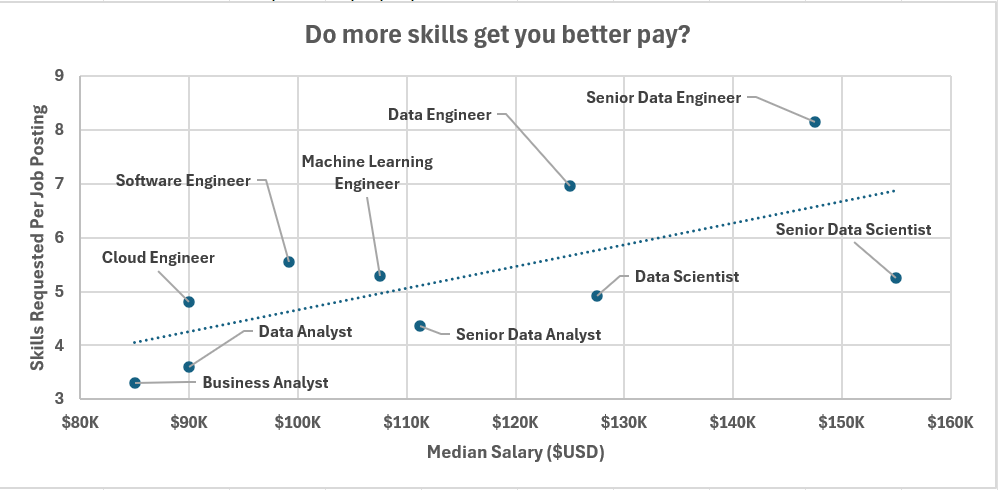

# My Excel Data Analytics Projects  

## 1. Salary Dashboard  
This dashboard provides job seekers with interactive tools to analyze salary data for Data-related roles, helping them assess market compensation and negotiate confidently.  

[check out my work here](Project_1-Dashboard)  

  

## 2. Salary Analysis  
As a Data Enthusiast exploring the evolving analytics landscape, I initiated this data-driven investigation into the industry's compensation dynamics and skill requirements. Through rigorous analysis of market data, I examined how technical competencies correlate with earning potential, identified regional salary patterns, and uncovered the most valued skills in today's data-driven world.  

[check out my work here](Project_2-Analysis)  

Sneak Peak of what to Expect.  

  

  
 

# You might be wondering how I ended up with such Projects, Well, here's all I went through  

## Table of Contents

### [Course Problem Workbooks](/0_Resources/Problems/)

- The Workbooks to solve practice problems
    - [I'm here, Click Me](https://lukebarousse.com/excel)

### [Chapter 1: Spreadsheets_Intro](/1_Spreadsheets_Intro/)
- Worksheets
- Workbooks
- Ribbon
- Menu
- Keyboard Shortcuts
### [Chapter 2: Formulas & Functions](/2_Formulas_Functions/)
- Formulas
- Functions
- Logical Functions
- Text Functions
- Date Functions
- Lookup Functions
- Math Functions
- Statistical Functions
### [Chapter 3: Charts](/3_Charts_Graphs/)
- Chart Types
- Chart Elements
- Chart Styles
- Chart Axes
- Chart Layouts
- Chart Templates
### [Chapter 4: Spreadsheets Advanced](/4_Spreadsheets_Advanced/)
- Tables
- Conditional Formatting
- Formatting
- Collaboration
### [Chapter 5: Pivot Tables](/5_Pivot_Tables/)
- Pivot Tables
- Pivot Charts
- Pivot Tables Advanced
### [Chapter 6: Advanced Data Analysis](/6_Advanced_Data_Analysis/)
- Analysis Add-ins
- Solver
- Scenario Manager
- Goal Seek
- Data Tables
### [Chapter 7: Power Query](/7_Power_Query/)
- Power Query
- Power Query Editor
- Power Query M Language
- Power Query Advanced
### [Chapter 8: Power Pivot](/8_Power_Pivot/)
- Power Pivot
- Power Pivot DAX
- Power Pivot Data Models
