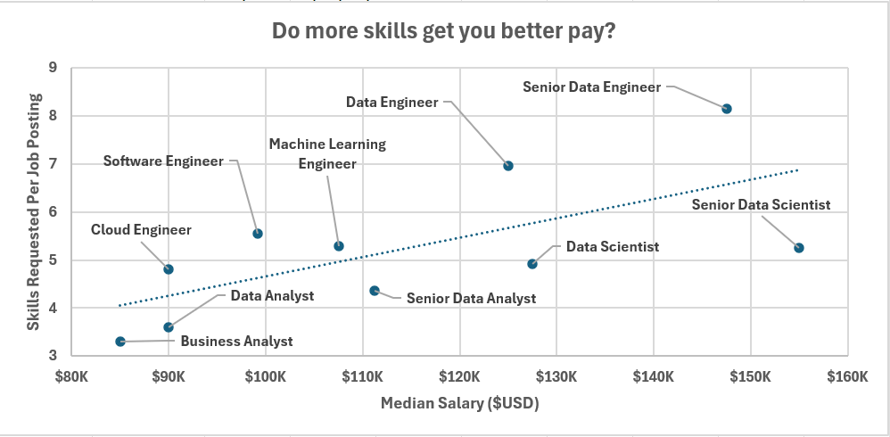
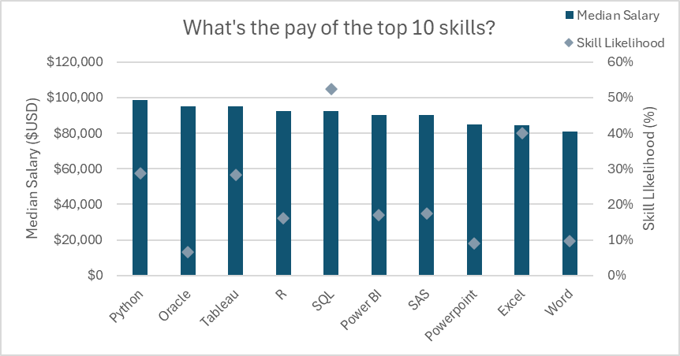

# Excel Data Analytics Projects

A portfolio of Excel-based analytics projects exploring compensation trends, skill value, and market trends in the data industry.

---

## Projects

### 1. Salary Dashboard

An interactive dashboard for exploring compensation across data-related roles. Filter by job title, country, and schedule type to surface median salaries and understand what drives them.

[View the Dashboard](Project_1-Dashboard)

*Salary breakdowns by role, location, and schedule type*

---

### 2. Salary Analysis

A structured investigation into what the data job market actually rewards - which skills command higher pay, how compensation shifts across regions, and which skills are most in demand. Built using Excel's Power tools for a full ETL-to-insight workflow.

[Explore the Analysis](Project_2-Analysis)

*Salary distribution and skill demand across job titles*

*Skill likelihood versus median pay*

---

## Foundation

These projects were built progressively across core areas of Excel practice - from spreadsheet fundamentals through advanced data analysis and Power tools. The [course workbooks](0_Resources/Problems) are available if you want to trace the learning path behind the work.